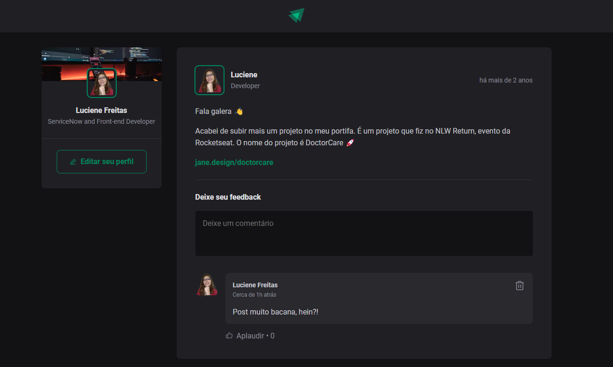

  

 

 

# Post - ReactJs

Este projeto é uma aplicação simples desenvolvida em **React** com **TypeScript**. Ela permite adicionar e deletar comentários em posts, explorando conceitos fundamentais do React como componentes, propriedades, estados, imutabilidade, hooks, e mais.
 

 
<h2 align="left"> 🚀 Tecnologias Utilizadas </h2>

- **React**: Biblioteca JavaScript para construção de interfaces de usuário.
- **TypeScript**: Superset do JavaScript que adiciona tipagem estática opcional.
- **CSS Modules**: Para estilização modularizada dos componentes.
- **Phosphor Icons**: Biblioteca de ícones utilizada para adicionar ícones ao projeto.
 
 

## 🚀 Funcionalidades

- **Adicionar Comentários**: Os usuários podem adicionar comentários aos posts.
- **Deletar Comentários**: Os usuários podem deletar comentários existentes.
- **Contagem de Likes**: Cada comentário possui um botão de "aplaudir" para incrementar a contagem de likes.
 
 

## 📚 Conceitos Abordados

- **Componentes**: Construção de componentes reutilizáveis para estruturar a aplicação.
- **Propriedades (Props)**: Passagem de dados entre componentes utilizando props.
- **Estados**: Gerenciamento de estado local utilizando o hook `useState`.
- **Imutabilidade**: Aplicação do conceito de imutabilidade ao trabalhar com estados.
- **Hooks**: Uso de hooks como `useState` para controlar o estado e ações do usuário.
 
 

## 📸 Prévia do Projeto

  

 

[Assista a Prévia do Projeto](https://youtu.be/BXZdz1qQHBA)
 
 

  ## ✔️ Autora

- [LucieneFreitas](https://github.com/LucieneFreitas)
 
 
## 📄 Referência

- [ROCKETSEAT](https://www.rocketseat.com.br/)